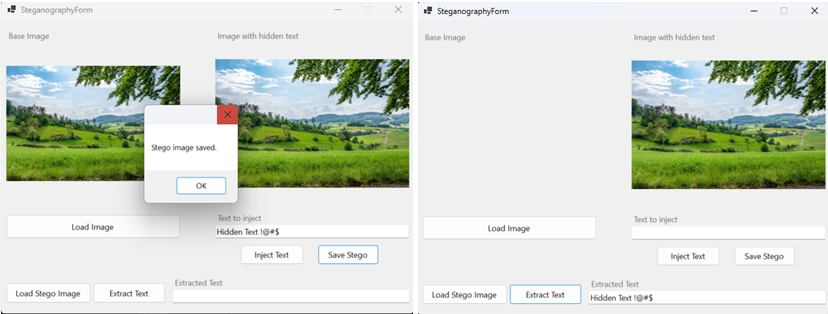

# MoSteganography

A simple yet powerful Windows Forms application (built in **.NET 8**) that allows users to hide secret text messages inside images (steganography) and later extract them. This project is ideal for learning how to embed payload data in image files using the Least Significant Bit (LSB) technique.



> **Note**: The screenshot above is a placeholder. Replace it with one of your own if desired.

## Table of Contents
1. [Features](#features)  
2. [Project Structure](#project-structure)  
3. [How It Works](#how-it-works)  
4. [Getting Started](#getting-started)  
   - [Prerequisites](#prerequisites)  
   - [Installation](#installation)  
   - [Running the Application](#running-the-application)  
5. [Usage](#usage)  
   - [Hiding Text in an Image](#hiding-text-in-an-image)  
   - [Extracting Text from an Image](#extracting-text-from-an-image)  
6. [Testing](#testing)  
7. [Contributing](#contributing)  
8. [License](#license)  

---

## Features
- **LSB Steganography**: Uses the Least Significant Bit method to embed text data within an image’s pixel color channels.
- **Windows Forms UI**: Friendly GUI for loading images, injecting secret text, saving the stego image, and later extracting the secret text.
- **.NET 8**: Built using the latest .NET runtime for improved performance and modern features.
- **Unit Tests**: Contains xUnit tests to ensure reliability and correctness of the embedding and extraction process.

---

## Project Structure

```
MoSteganographyProject/
│
├── MoSteganographyProject.sln             // The main solution file.
├── MoSteganography/                       // Windows Forms application project
│   ├── Form1.cs                           // Main form with UI logic
│   ├── Form1.Designer.cs                  // Auto-generated code by Visual Studio
│   ├── Form1.resx                         // Resource file for form
│   ├── Program.cs                         // Application entry point
│   └── ... (other Windows Forms files)
│
├── MoSteganography.Core/                  // Core logic library
│   └── ImageSteganography.cs              // Contains EmbedText and ExtractText methods
│
└── MoSteganography.core.Test/             // Test project using xUnit
    └── ImageSteganographyTests.cs         // Unit tests for the core library
```

---

## How It Works

1. **Least Significant Bit (LSB)**: The app modifies the least significant bit of each color component (R, G, B) in an image’s pixels to store the binary data of your secret text.
2. **Capacity Checks**: The code checks if the text can fit within the available capacity (based on the image size). It includes 4 bytes to store the text length before the actual text.
3. **Extraction**: When reading the embedded data, the tool parses the first 32 bits (4 bytes) to determine how many bytes of text are stored, then proceeds to read that many bytes from the LSBs of the image.

---

## Getting Started

### Prerequisites
- **.NET 8** SDK (or later).  
- Visual Studio 2022 (or a suitable .NET 8–compatible IDE) recommended.  
- (Optional) [Git](https://git-scm.com/) for source control.

### Installation
1. **Clone the Repository**  
   ```bash
   git clone https://github.com/<your-username>/MoSteganographyProject.git
   cd MoSteganographyProject
   ```

2. **Open the Solution**  
   - Open `MoSteganographyProject.sln` in Visual Studio **OR**  
   - From a terminal, navigate into the folder and run the application using `dotnet run --project .\MoSteganography\MoSteganography.csproj`.

### Running the Application
- In Visual Studio:  
  1. Right-click on **MoSteganography** project.  
  2. Select **Set as Startup Project**.  
  3. Click **Start** (or press **F5**).

- Or from the command line:  
  ```bash
  cd MoSteganography
  dotnet run
  ```

---

## Usage

### Hiding Text in an Image

1. Select **Load Image**  
2. Enter your secret text in **Text to inject**  
3. Click **Inject Text**  
4. (Optional) Click **Save Stego** to store the new image to disk  

### Extracting Text from an Image

1. Select **Load Stego Image** to open the modified image  
2. Click **Extract Text** to read the hidden message  
3. Check the **Extracted Text** field for the revealed secret  

---

## Testing

This solution uses **xUnit** for unit tests in the `MoSteganography.core.Test` project. To run the tests:

- **In Visual Studio**: Go to **Test Explorer** → **Run All Tests**.  
- **From the command line** (in the repository root):
  ```bash
  dotnet test
  ```

---

## Contributing

Contributions are welcome! If you have suggestions for improvements, feel free to:
1. Fork the repository.
2. Create a new branch for your feature or fix.
3. Make your changes and push the branch.
4. Open a Pull Request describing your changes.

---

## License

This project is based on a free version project and is open-sourced under the [MIT License](LICENSE). You are free to use, modify, and distribute it as permitted by the license.  

> **Disclaimer**: While steganography can help obscure information, it is **not** the same as cryptographic security. Use responsibly and ensure compliance with all relevant laws.

---

**Happy Hiding and Extracting!** If you have any questions or need support, please open an [issue](https://github.com/YourUsername/MoSteganographyProject/issues).

